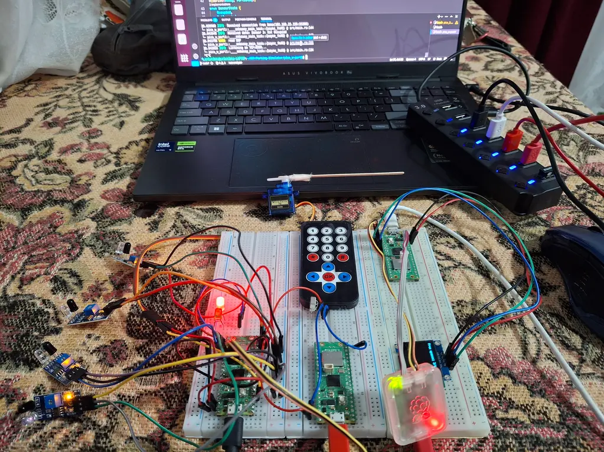
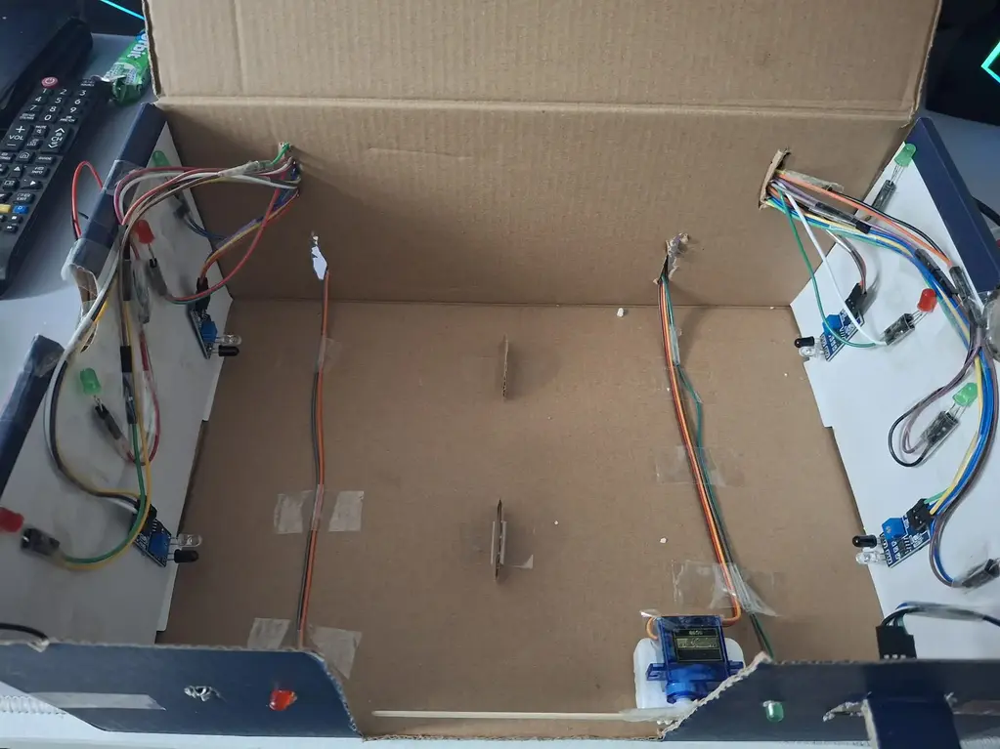

# Parking-Simulator

A hardware project programmed in Rust that simulates a parking system. The system includes a barrier controlled by a servo motor, which receives commands from an IR remote, and parking spots equipped with movement sensors. The project is built as part of the university Microprocessors' Architecture class.

---

## Overview

The Parking-Simulator consists of three important components, each running on a separate board:

### 1. **Main Board**
- **Purpose**: Acts as the central controller for the system.
- **Responsibilities**:
  - Manages the servo motor controlling the parking barrier.
  - Handles communication with the other boards via WiFi.
  - Sends information to Display Board about the motion sensors.
  - Processes IR remote commands to open or close the barrier.
- **Key Features**:
  - Uses the CYW43439 WiFi chip for networking.
  - Implements Embassy's async framework for efficient task management.

### 2. **IR Receiver Board**
- **Purpose**: Decodes commands from the IR remote.
- **Responsibilities**:
  - Detects and decodes IR signals.
  - Sends decoded commands to the main board over WiFi.
- **Key Features**:
  - Uses Embassy's GPIO and time management libraries for precise signal decoding.

### 3. **Display Board**
- **Purpose**: Displays the parking lot status on an OLED screen.
- **Responsibilities**:
  - Tracks the occupancy of parking spots.
  - Updates the display with the number of free and occupied spots.
- **Key Features**:
  - Uses the SSD1306 OLED driver for rendering text and graphics.
  - Communicates with the main board to receive parking spot updates.





---

## How to Run the Code

>Prerequisites: Have the necessary hardware, installed necessary tools to run Rust on RP Pico

```
cd placeholder-board
cargo run # Assuming a debug probe is used
```

```
cd placeholder-board
cargo build # Grab the compiled binary from target/thumb.../debug/ folder and flash it
```